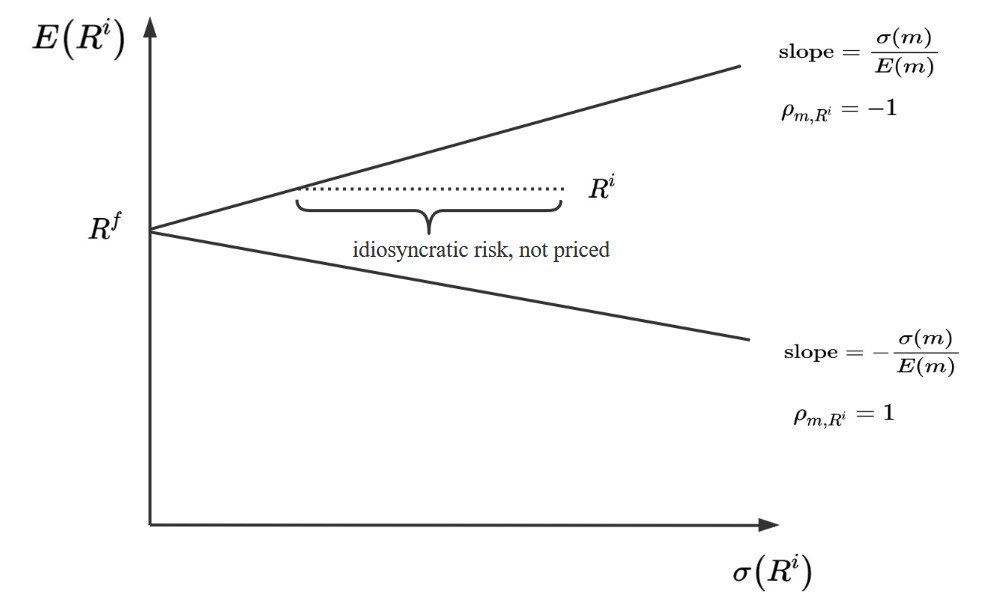

---
jupytext:
  text_representation:
    extension: .md
    format_name: myst
    format_version: 0.13
    jupytext_version: 1.11.1
kernelspec:
  display_name: Python 3
  language: python
  name: python3
---

## Elementary asset pricing theory


This lecture summarize the heart of applied asset-pricing theory.

From a single equation, we'll derive 

* a mean-variance frontier 

* a single-factor model of excess returns on each member of a collection of assets


To do this, we use two ideas:

  * an asset pricing equation
  
  * a Cauchy-Schwartz inequality

We  begin with a **key asset pricing equation**:


$$
 E m R^i = 1  
$$ (eq:EMR1)

for $i=1, \ldots, I$ and where
 
$$\begin{aligned}
m &=\text { stochastic discount factor } \\
R^{i} &= \text {random gross return  on asset }  i \\
E &\sim \text { mathematical expectation }
\end{aligned}$$

The random gross returns $R^i$ and the scalar stochastic discount factor $m$ live 
live in a common probability space. 

{cite}`HansenRichard1987` and {cite}`Hansen_Jagannathan_1991` explain how the existence of a scarlar stochastic discount factor that verifies  equation
{eq}`eq:EMR1` is implied by a __law of one price__ that requires that all portfolios of assets 
that end up having the same payouts must have the same price.

They also explain how the __absence of an arbitrage__ implies that the stochastic discount
factor $m \geq 0$.


We combine  key equation {eq}`eq:EMR1` with a  remark of Lars Peter Hansen that   "asset pricing theory is all about covariances".

```{note}
Lars Hansen's remark is a concise summary of ideas in {cite}`HansenRichard1987` and
{cite}`Hansen_Jagannathan_1991`. For other important foundations of these ideas, see
{cite}`Ross_76`, {cite}`Ross_78`, {cite}`Harrison_Kreps_JET_79`, {cite}`Kreps_81`, and
{cite}`Chamberlain_Rothschild`.
```

By that remark, Lars Hansen meant that interesting restrictions can be deduced by recognizing that $E m R^i$ is a component of the covariance between $m $ and $R^i$ and then using that fact to rearrange key equation  {eq}`eq:EMR1`.


Let's do this step by step.

First note  that the definition 
$\operatorname{cov}\left(m, R^{i}\right)  =  E (m - E m)(R^i - E R^i) $
of a
covariance implies that

$$ E m R^i = E m E R^{i}+\operatorname{cov}\left(m, R^{i}\right)  $$

Substituting this result into 
key equation {eq}`eq:EMR1` gives

$$
1 = E m E R^{i}+\operatorname{cov}\left(m, R^{i}\right) 
$$ (eq:EMR2) 
 
Next note that for a risk-free asset with non-random gross return $R^f$, equation
{eq}`eq:EMR1` becomes 

$$
1 = E R^f m = R^f E m.
$$

This is true because we can pull the constant $R^f$ outside the mathematical expectation. 

It follows that the  gross return on a risk-free asset is

$$ 
R^{f}  = 1 / E(m) 
$$

Using this formula for $R^f$ in equation {eq}`eq:EMR2` and rearranging, it follows that

$$
R^{f} = E R^{i}+\operatorname{cov}\left(m, R^{i} \right) R^{f}
$$

which can be rearranged to become

$$E R^i = R^{f}-\operatorname{cov}\left(m, R^{i}\right) R^{f} . $$

It follows that we can express an **excess return** $E R^{i}-R^{f}$ on asset $i$ relative to the risk-free rate as

$$ E R^{i}-R^{f} = -\operatorname{cov}\left(m, R^{i}\right) R^{f} 
$$ (eq:EMR3)
 

Equation {eq}`eq:EMR3` can be rearranged to display important parts of asset pricing theory.


**Expected return - Beta representation**

We can obtain the celebrated **expected-return-Beta -representation** for gross return $R^i$ simply  by rearranging excess return equation {eq}`eq:EMR3` to become

$$
E R^{i}=R^{f}+\left(\underbrace{\frac{\operatorname{cov}\left(R^{i}, m\right)}{\operatorname{var}(m)}}_{\quad\quad\beta_{i,m} = \\ \text{regression coefficient}}\right)\left(\underbrace{-\frac{\operatorname{var}(m)}{E(m)}}_{\quad\lambda_{m} = \\ \text{price of risk}}\right) 
$$
 
or

$$
E R^{i}=R^{f}+\beta_{i, m} \lambda_{m} 
$$ (eq:ERbetarep)

Here 

 * $\beta_{i,m}$ is a (population) least squares regression coefficient of gross return $R^i$ on stochastic discount factor $m$, an object that is often called asset $i$'s **beta**
 
 * $\lambda_m$ is minus the variance of $m$ divided by the mean of $m$, an object that is often called the **price of risk**.
 
To interpret this representation it helps to provide the following widely used example.
 
 
**Example** 

A popular model of $m$ is

$$ m_{t+1} = \exp(-\rho) \exp(- \gamma(c_{t+1} - c_t)) $$

where $ \rho > 0$, $\gamma > 0$,  and the log of consumption growth is governed by

$$ c_{t+1} - c_t = \mu + \sigma_c \epsilon_{t+1} $$

where $\epsilon_{t+1} \sim {\mathcal N}(0,1)$.

Here 

  * $\gamma >0$ is a coefficient of relative risk aversion
  
  * $\rho >0 $ is a fixed intertemporal discount rate 
  


$$ m_{t+1} = \exp(-\rho) \exp( - \gamma \mu - \gamma \sigma_c \epsilon_{t+1}) $$

In this case 

$$ E m_{t+1} = \exp(-\rho) \exp \left( - \gamma \mu + \frac{\sigma_c^2 \gamma^2}{2} \right) $$

and 

$$ \operatorname{var}(m_{t+1}) = E(m) [ \exp(\sigma_c^2 \gamma^2) - 1) ] $$

When $\gamma >0$, it is true that  

 * when consumption growth is **high**, $m$ is **low**
 
 * when consumption growth is **low**, $m$ is **high**
 
According the representation {eq}`eq:ERbetarep`, an asset with an $R^i$ that can be expected to be high when consumption growth is low  has $\beta_i$ positive and a low expected return.  

   * because it has a high gross return when consumption growth is low, it is a good hedge against consumption risk, which justifies its low average return

An asset with an $R^i$ that is low when consumption growth is low has $\beta_i$ negative and a high expected return.

  * because it has a low gross return when consumption growth is low, it is a poor hedge against consumption risk, which justifies its high average return


 

**Mean-Variance Frontier**

Now we'll derive the celebrated **mean-variance frontier**.

We do this using a classic method of Lars Peter Hansen and Scott
Richard {cite}`HansenRichard1987`. 

```{note}
Methods of Hansen and Richard are described and used extensively by {cite}`Cochrane_2005`.
```

Their  idea was rearrange the key equation  {eq}`eq:EMR1`, namely,  $E m R^i = 1$, and then  to  apply the Cauchy-Schwarz inequality.

A convenient way to remember the Cauchy-Schwartz inequality in our context is that it says that an  $R^2$ in any regression has to be  less than or equal to $1$.

Let's apply that idea to deduce


$$ 
1= E\left(m R^{i}\right)=E(m) E\left(R^{i}\right)+\rho_{m, R^{i}}\frac{\sigma(m)}{E(m)} \sigma\left(R^{i}\right) 
$$ (eq:EMR5) 

where $\rho_{m, R^i}$ is the correlation coefficient  defined as

$$ \rho_{m, R^i} \equiv \frac{\operatorname{cov}\left(m, R^{i}\right)}{\sigma(m) \sigma\left(R^{i}\right)} 
$$


and where $\sigma$ denotes the standard deviation of the variable in parentheses

Equation {eq}`eq:EMR5`  implies

$$E R^{i}=R^{f}-\rho_{m, R^i} \frac{\sigma(m)}{E(m)} \sigma\left(R^{i}\right)$$

Because $\rho_{m, R^i} \in [-1,1]$, it follows that  $|\rho_{m, R^i}| \leq 1$ and that

$$
\left|E R^i-R^{f}\right| \leqslant \frac{\sigma(m)}{E(m)} \sigma\left(R^{i}\right) 
$$ (eq:ERM6)

Inequality {eq}`eq:ERM6` delineates a **mean-variance frontier**

(Actually, it looks more like a **mean-standard-deviation frontier**)


Evidently, points on the frontier correspond to gross returns that are perfectly correlated
(either positively or negatively) with the stochastic discount factor $m$.

We summarize this observation  as

$$\rho_{m, R^{i}}=\left\{\begin{array}{ll}
+1 & \implies R^i \text { is on  lower frontier } \\
-1 & \implies R^i \text { is on  an upper frontier }
\end{array}\right.$$

The image below illustrates a mean-variance frontier.



The mathematical  structure of the mean-variance frontier described by inequality {eq}`eq:ERM6` implies 
that


- all returns on frontier are perfectly correlated.

  Thus,
   
   * Let $R^m, R^{mv}$ be two returns on frontier. 
   
   * Then for some scalar $a$ 
   
   * $R^{m v}=R^{f}+a\left(R^{m}-R^{f}\right)$ 
  
  This is an **exact** equation with no **residual**
 
 
- each return $R^i$ that is on the mean-variance frontier is perfectly correlated with $m$ 
  
   *  $\left(\rho_{m, R^{i}}=-1\right) \Rightarrow \begin{cases} m=a+b R^{m v} \\ R^{m v}=e+d  m  \end{cases}$ for some scalars $a, b, e, d$, 
   
   Therefore, **any return on the mean-variance frontier is a legitimate stochastic discount factor**


- for any mean-variance-efficient return $R^{m v}$ that is on the frontier but that is  **not** $R^{f}$, there exists  a **single-beta representation** for any return $R^i$ that takes the form:

$$ E R^{i}=R^{f}+\beta_{i, R^{m v}}\left[E\left(R^{m v}\right)-R^{f}\right] 
$$ (eq:EMR7) 
   
- The special case of a single-beta representation {eq}`eq:EMR7` with $ R^{i}=R^{m v}$   is 
  
  $E R^{m v}=R^{f}+1 \cdot\left[E\left(R^{m v}\right)-R^{f}\right] $
  

+++

**Empirical implementations**


We briefly describe empirical implementations of multi-factor generalizations of the single-factor model described above.  

The single-beta representation  {eq}`eq:EMR7` is a special case with there being just a single factor.

Two representations are often used in empirical work.  


One is a  **time-series regression** of  gross return $R_t^i$ on multiple
risk factors $f_t^j, j = a, b, \ldots $ that is designed to uncover exposures of return $R^i$ to each of a set of  **risk-factors** $f_t^j, j = a, b, \ldots, $:

- $$R_{t}^{i}=a_{i}+\beta_{i, a} f_{t}^{a}+\beta_{i, b} f_{t}^{b}+\ldots+\epsilon_{t}^{i}, \quad t=1,2, \ldots, T\\
\epsilon_{t}^{i} \perp f_{t}^{j}, i=1,2, \ldots, I; j = a, b, \ldots 
$$

For example:

   * a popular **single-factor** model specifies the single factor  $f_t$ to be the return on the market portfolio 
   
   * another popular **single-factor** model called the consumption based model specifies the factor to be  $ m_{t+1} = \beta \frac{u^{\prime}\left(c_{t+1}\right)}{u^{\prime}\left(c_{t}\right)}$, where $c_t$ is a representative consumer's time $t$ consumption.
   
Model objects are interpreted as follows:   
 
   * $\beta_{i,a}$ is the  exposure of return $R^i$ to factor $f_a$ risk
   
   * $\lambda_{a}$ is the  price of exposure to factor $f_a$ risk
   
   

The other representation entails  a **cross-section regression**  of **average returns** to assets
$i =1, 2, \ldots, I$ on *prices of risk* $\lambda_j$ for $j =a, b, c, \ldots$ 

Here is the regression specification:


$$
\begin{aligned}
E R^{i} &  =\gamma+\beta_{i, a} \lambda_{a}+\beta_{i, b} \lambda_{b}+\cdots \\
 & \quad \text{for } i=1,2, \ldots, I \sim \text { returns } R^i \\
 \lambda_{j}, & j=a, b, \ldots \ldots = \text { price of  exposure } 
 \text { to risk factor } a, b, \ldots 
\end{aligned}
$$


+++

**Testing strategies:**

Time-series and cross-section regressions play roles in both  **estimating** and **testing** beta representation
models.

The basic idea is to implement the following two steps.

**Step 1:**

- Estimate $a_{i}, \beta_{i, a}, \beta_{i, b}, \cdots$ by running a **time series regression:** $R_{t}^{i}$ on a constant and $f_{t}^{a}, f_{t}^{b}, \ldots$


**Step 2:**

- take the $\beta_{i, j}$'s estimated in step one as regressors together with data on average returns
$E R^i$ over some period and then  estimate the  **cross-section regression**


$$\underbrace{E\left(R^{i}\right)}_{\text{average return over time series}}=\gamma+\underbrace{\beta_{i, a}}_{\text{regressor}\quad} \underbrace{\lambda_{a}}_{\text{regression}\\\text{coefficient}}+\underbrace{\beta_{i, b}}_{\text{regressor}\quad} \underbrace{\lambda_{b}}_{\text{regression}\\\text{coefficient}}+\cdots+\underbrace{\alpha_{i}}_{\text{pricing errors}}, i=1, \ldots, I; \quad \underbrace{\alpha_i \perp \beta_{i,j},j = a, b, \ldots}_{\text{least squares orthogonality condition}}$$

- estimate $\gamma, \lambda_{a}, \lambda_{b}, \ldots$ by an appropriate regression technique, being thoughtful about recognizing that the regressors have been generated by a step 1 regression.

Note that presumably  the risk-free return $E R^{f}=\gamma$.

For excess returns $R^{ei} = R^i - R^f$ we have

$$
E R^{e i}=\beta_{i, a} \lambda_{a}+\beta_{i, b} \lambda_{b}+\cdots+\alpha_{i}, i=1, \ldots, I
$$
